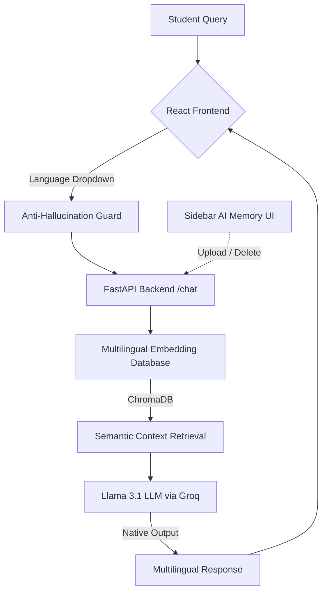

<div align="center">
  <h1>🌍 Delta Force | Campus Assistant AI</h1>
  <h3>The Ultimate "Pan-India" Language-Agnostic RAG Chatbot</h3>
</div>

<br />

## 🎯 The Problem
Campus offices handle thousands of repetitive student queries every semester regarding fees, scholarships, and schedules. A massive **communication gap** exists when students prefer regional languages like Hindi, Marathi, or Tamil, while institutional information remains buried in English PDFs.

## 🚀 The Solution
**Campus Assistant AI** (built by Delta Force) is a multilingual conversational chatbot that shatters language barriers. It dynamically reads English PDFs and circulars, then answers student queries with hyper-accurate facts in **10+ major Indian languages** using an advanced Retrieval-Augmented Generation (RAG) architecture.

---

## 🏗️ Model Architecture


---

## ✨ Key Features
- **🛡️ Anti-Hallucination Guard:** The LLM's prompt is mathematically injected with the user's specific language dropdown choice (e.g., "You MUST respond exclusively in Tamil"), fully eliminating random "language hallucination", even if students type questions using Romanized English characters.
- **🖥️ Dynamic Memory UI (Zero-Restart):** The frontend Sidebar features an "AI Memory" section where you can instantly Upload or Delete PDF/TXT files. The backend seamlessly injects or torches the data from the Vector DB without ever restarting the server.
- **⚡ Quick Action Hotbars:** Pre-built chips for common institutional questions (Fees, Timings, Departments) so students with lower English literacy do not have to type.
- **🗣️ Pan-India Support:** English, Hindi, Marathi, Bengali, Tamil, Telugu, Malayalam, Kannada, Gujarati, Punjabi, Urdu, Odia, and Assamese.
- **💻 Multilingual Embeddings:** Uses `paraphrase-multilingual-MiniLM-L12-v2` for cross-lingual understanding.

---

## 🛠️ Technology Stack
- **Frontend:** React 18, TypeScript, Tailwind CSS, shadcn/ui.
- **Backend:** Python 3.11 (Required for library compatibility), FastAPI, LangChain.
- **AI/ML:** Llama 3.1 8B (LLM), ChromaDB (Vector DB), HuggingFace (Embeddings).

> [!IMPORTANT]
> **Python Version:** This project requires **Python 3.11**. Using newer versions like Python 3.13 may cause issues with `chromadb` and `torch` dependencies.

---

## 💻 Getting Started

### 📅 Current Versioning
- **Last Updated:** April 4th, 2026
- **Status:** Hackathon MVP Ready (Delta Force Edition)

### 🌐 Live Production Demos
The application is fully deployed and natively hosted 24/7 in the cloud. You can test it immediately without cloning the repository:
- **Frontend UI (Vercel Edge Network):** [https://language-agnostic-chatbot-eta.vercel.app](https://language-agnostic-chatbot-eta.vercel.app)
- **Backend API (Hugging Face 16GB Docker Space):** [https://huggingface.co/spaces/heyak/campus-backend](https://huggingface.co/spaces/heyak/campus-backend)

---

### 1. Local Development (Backend)
```bash
cd backend
python -m venv venv
# Activate virtual environment
# Windows:
.\venv\Scripts\activate
# Mac/Linux:
source venv/bin/activate

pip install -r requirements.txt
```
Create `.env` in `backend/` with your API Key: `GROQ_API_KEY="your_key"`.
*Note: Make sure `python-multipart` is installed, as it allows dynamic PDF uploads via the frontend interface.*

Run the backend:
```bash
python main.py
```

### 2. Setup Frontend
Open a new terminal window:
```bash
cd frontend
npm install
npm run dev
```

---

## 📜 Citations & Credits
Developed by **Team Delta Force**. 

This project utilizes the following open-source frameworks:
- **Meta Llama 3.1 8B**: Large Language Model for multilingual reasoning.
- **HuggingFace paraphrase-multilingual-MiniLM-L12-v2**: Multilingual sentence embeddings.
- **LangChain**: Framework for building context-aware RAG applications.
- **ChromaDB**: High-performance local vector database.
- **FastAPI / python-multipart**: High-speed asynchronous Python server parsing raw HTTP Form-Data uploads. 
- **shadcn/ui & Lucide React**: Premium component library and iconography.
